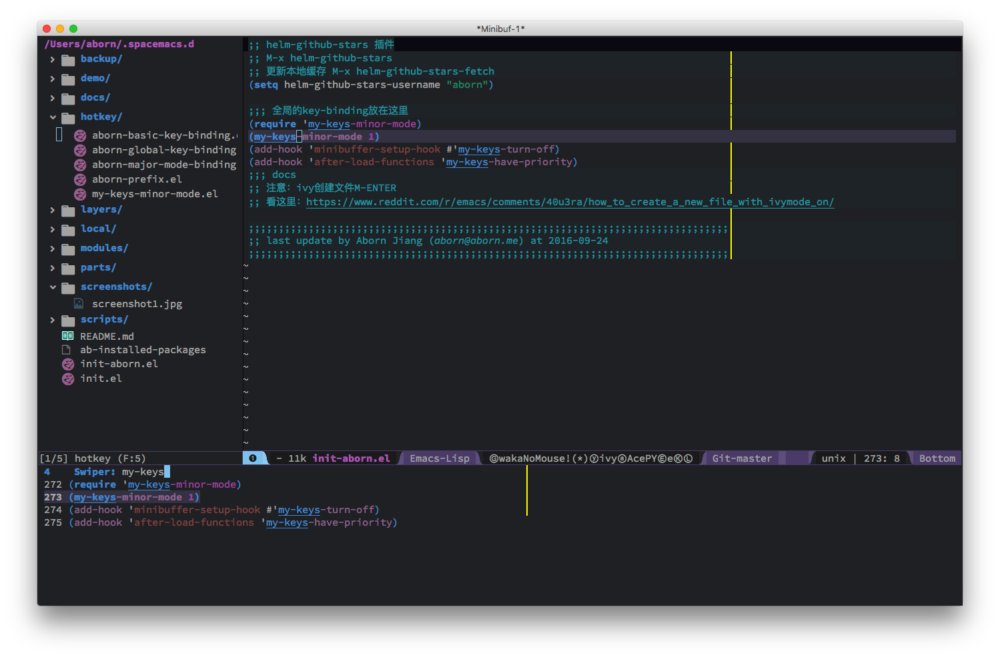
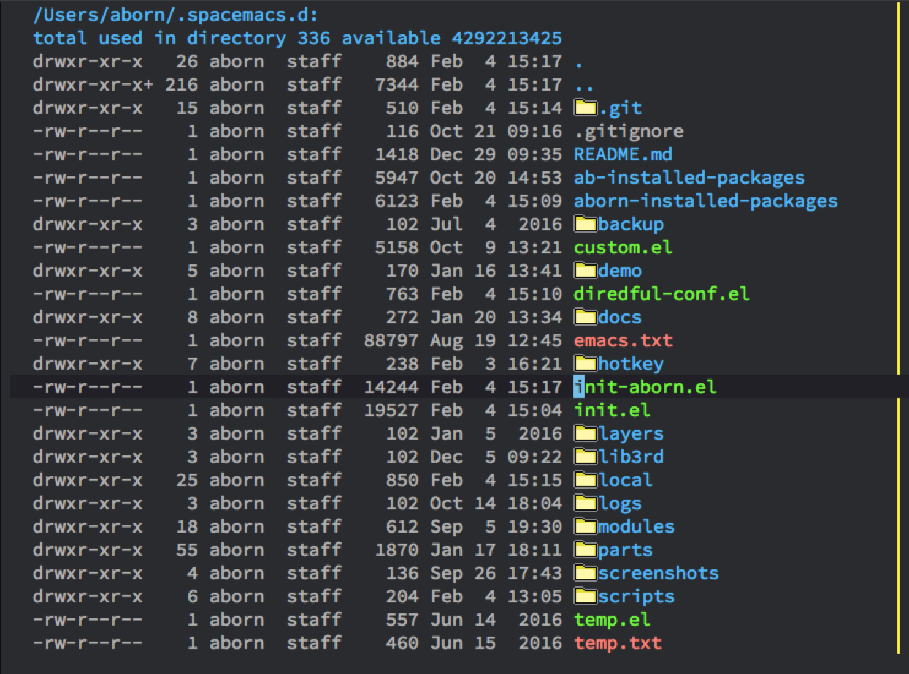

# .spacemacs.d
spacemacs 的个人配置及键绑定,主要配置入口为: [init-aborn.el](https://github.com/aborn/.spacemacs.d/blob/master/init-aborn.el)
详细配置请参考[使用手册](./docs/manual.org)

## 配置项目结构
配置文件入口为[init.el](./init.el)及[init-aborn.el](./init-aborn.el)，大部分配置文件存放在*modules*和*parts*文件夹里，按键的绑定在*hotkey*文件夹。
* **backup** 备份文件  
* **demo** 一些示例代码，仅用于debug  
* **docs** 文档目录  
* **hotkey** 按键绑定的配置,全局按键的绑定见[my-keys-minor-mode.el](./hotkey/my-keys-minor-mode.el)  
* **layers** 自己写的layer  
* **lib3rd** 第三方的库，主要保存从网上收集的比较有用的Emacs Lisp函数库  
* **modules** 文件夹主要保存网上的开源packages(主要是些不在melpa源里的包)  
* **parts** 主要一些自己写的配置及工具  
* **screenshots** 屏幕截图  
* **scripts** 存放一些有用的脚本  

## 基本按键
### 全局按键
全局按键放在[my-keys-mode](./hotkey/my-keys-minor-mode.el)这个mode里

### 最基本按键绑定
*C-j* 切换buffer  
*M-j* 打开文件  
*C-;* 快速下移5行  
*C-:* 快速上移动5行  
*C-'* 移动到一行最中间位置  

## screenshot 
* 整体效果图  

* 采用neotree模式的的效果  

* diredful的效果  

